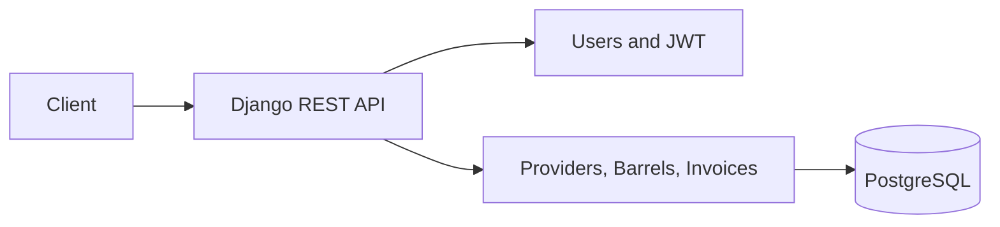

# django-billing-api

## Overview

django-billing-api is a small academic billing API built with Django REST Framework. It models providers, oil barrels, invoices and invoice lines, with JWT authentication and provider-scoped access.

## Architecture

The `users` app owns the custom user model, signup and token-protected user endpoints. The `billing` app contains the domain models and REST viewsets. `config` wires Django, OpenAPI documentation and the API routes.



## Domain model

- A `Provider` owns its barrels and invoices.
- A `Barrel` has a provider, a unique number within that provider, its oil type and its liter count.
- An `Invoice` belongs to one provider and contains invoice lines.
- An `InvoiceLine` references a barrel and records the billed liters, description and unit price.

## Authentication and authorization

`POST /api/token/` returns JWT access and refresh tokens. API endpoints require authentication. Superusers can manage all providers and users; normal users see data belonging to their linked provider. Querysets and create operations enforce this boundary server-side.

## Billing invariants

`Invoice.add_line_for_barrel` runs in a database transaction and locks the barrel while it validates the operation. It requires a matching provider, positive values and the barrel's full liter count. A barrel can only be billed once; successful billing marks it as billed. Invoice lines protect their barrel from deletion.

## Running locally

Clone the repository and copy `.env.example` to `.env` for a simple development setup, then run:

```bash
git clone https://github.com/dcoronil/django-billing-api.git
cd django-billing-api
```

```bash
docker compose up --build
docker compose exec web python manage.py migrate
docker compose exec web python manage.py seed_demo
```

The API is available at `http://localhost:8000`. Create a superuser with `docker compose exec web python manage.py createsuperuser` when needed.

## PostgreSQL and Docker

The normal configuration uses PostgreSQL and the `db` service from `docker-compose.yml`. `entrypoint.sh` waits for PostgreSQL, applies migrations and collects static files before starting Django. Production-like startup requires an explicit `DJANGO_SECRET_KEY`, `DJANGO_ALLOWED_HOSTS` and PostgreSQL credentials. The development fallback secret is allowed only with `DJANGO_DEBUG=1` or `DJANGO_TESTING=1`.

## Tests

Run the fast SQLite suite with:

```bash
DJANGO_TESTING=1 python manage.py test
```

CI also runs `manage.py check`, migrations and schema validation against PostgreSQL, verifies `collectstatic`, and checks the Docker Compose configuration.

## API documentation

- Swagger UI: `GET /api/schema/swagger-ui/`
- OpenAPI JSON: `GET /api/schema/`
- JWT: `POST /api/token/` and `POST /api/token/refresh/`
- Resources: `/api/providers/`, `/api/barrels/`, `/api/invoices/`

## Engineering decisions

The project keeps provider ownership in the database model and repeats the scope in API querysets so authorization is enforced at both layers. SQLite keeps the unit and API suite quick, while CI validates the real PostgreSQL configuration and migrations. Generated `staticfiles/`, caches, local databases and environment files are excluded from version control.

## Current limitations

This is an academic project with a compact API. It does not include a production deployment, background jobs, observability stack or a full payment provider integration. The development server is used by the Docker entrypoint and should be replaced by a production WSGI process for deployment.
